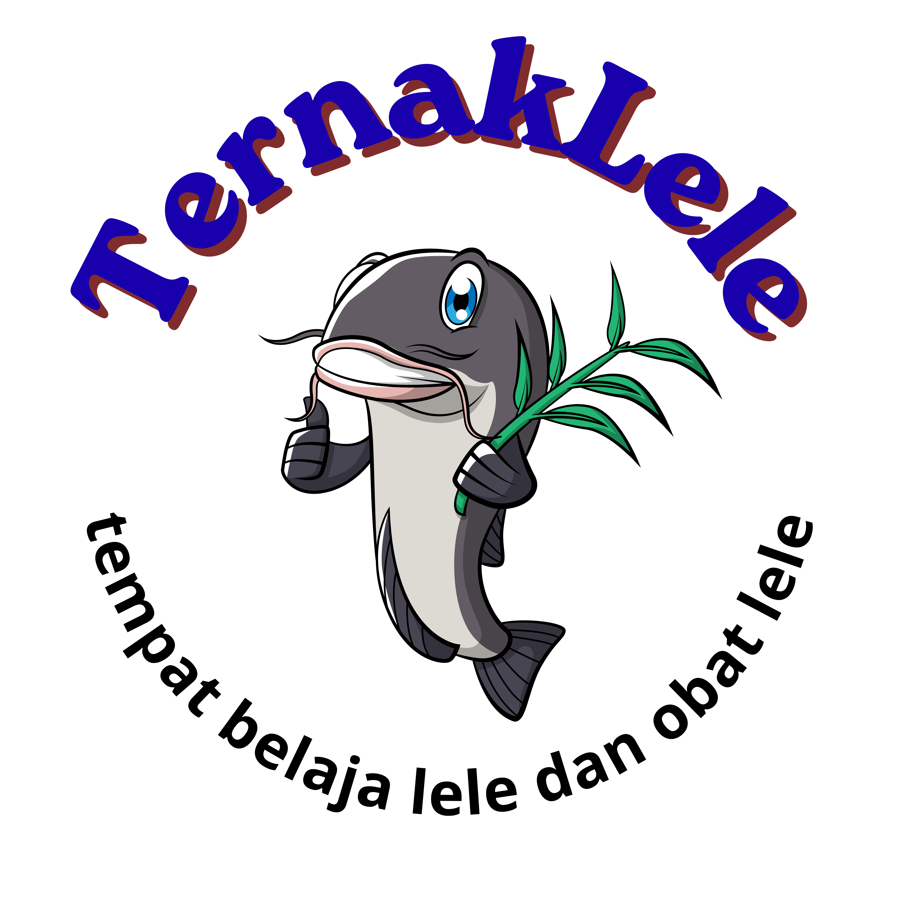
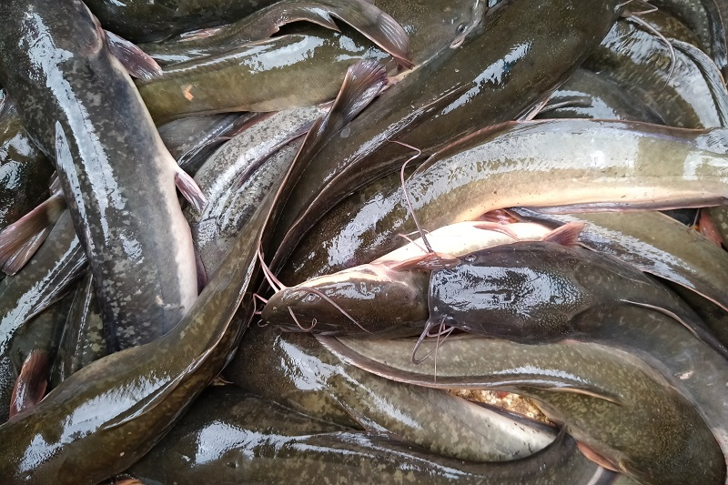
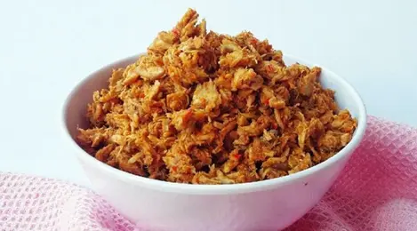
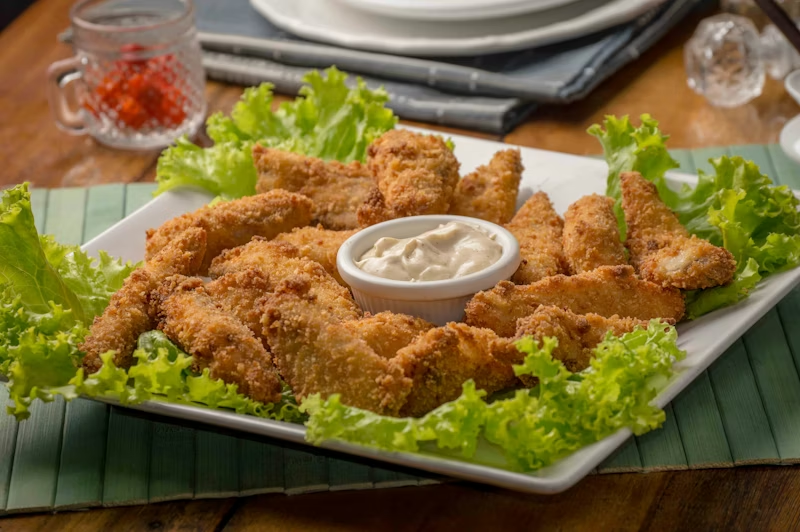
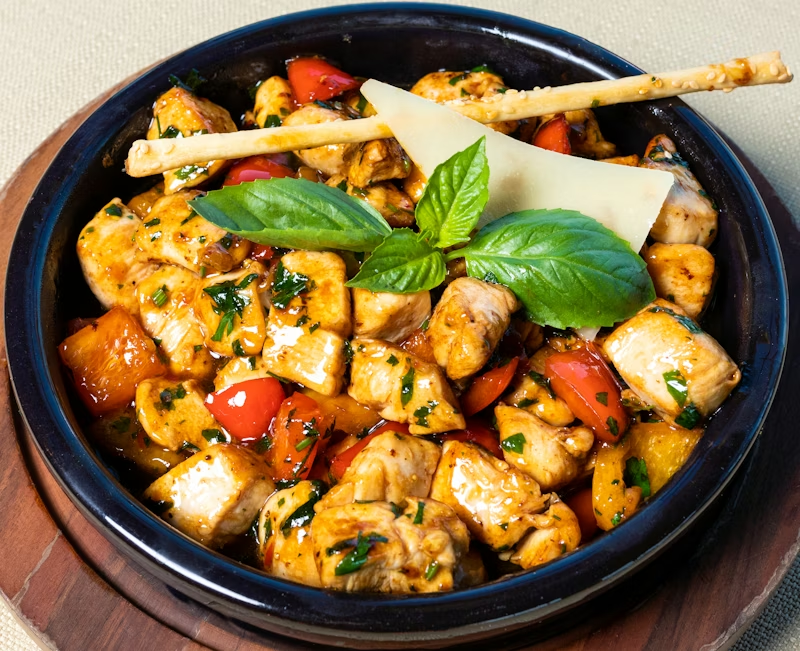
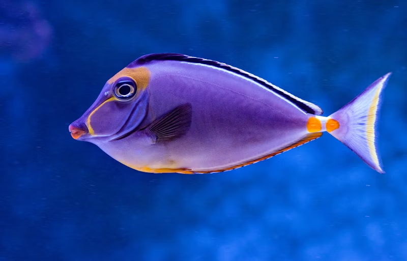
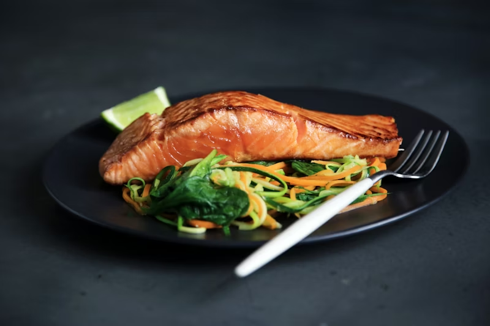

# TernakLele 🐟

**Ikan Lele Segar & Solusi Kesehatan | Fresh Catfish & Health Solutions**



---

## 📋 Tentang Aplikasi | About

**TernakLele** adalah platform digital untuk budidaya dan penjualan ikan lele konsumsi berkualitas tinggi, diperkaya dengan informasi kesehatan dan nutrisi. Aplikasi ini menyediakan:

- **Katalog Produk**: Ikan lele segar hasil budidaya modern dan produk olahan (abon, nugget, lele bumbu kuning)
- **Informasi Kesehatan**: Data lengkap tentang manfaat nutrisi ikan lele
- **Hasil Budidaya**: Galeri dan informasi proses budidaya
- **Sistem Pemesanan**: Pemesanan online dengan member benefits
- **Interface Responsif**: Desain mobile-first untuk kemudahan akses



---

## ✨ Fitur Utama | Key Features

### 🏠 Hero Section

- Presentasi visual yang menarik tentang brand TernakLele
- Call-to-action untuk pesan sekarang dan daftar member
- Statistik: 100% Organik, Layanan 24/7, 500+ Member Aktif

### 📚 Tentang (About)

- Penjelasan detail tentang budidaya ikan lele
- Komitmen terhadap kualitas dan kesehatan
- Proses produksi yang transparan

### 🛒 Katalog Produk (Product Showcase)

Kami menyediakan berbagai produk berkualitas tinggi:

| Produk                | Gambar                                                         |
| --------------------- | -------------------------------------------------------------- |
| **Abon Lele**         |                       |
| **Nugget Lele Sehat** |        |
| **Lele Bumbu Kuning** |  |

### 🏥 Informasi Kesehatan (Health Benefits)


Ikan lele kaya akan:

- Protein tinggi untuk pembangunan otot
- Omega-3 untuk kesehatan jantung
- Mineral penting (Kalsium, Besi, Fosfor)
- Vitamin B kompleks untuk energi


### 📦 Hasil Budidaya (Breeding Results)

Proses budidaya kami yang modern menghasilkan ikan berkualitas premium:





---

## 🛠️ Teknologi | Technology Stack

### Frontend

- **HTML5**: Semantic markup untuk struktur yang baik
- **Tailwind CSS**: Framework CSS utility-first untuk styling responsif
- **Phosphor Icons**: Icon library modern dan minimalis
- **JavaScript**: Vanilla JS untuk interaktivitas
- **Google Fonts (Inter)**: Typography yang elegant

### Design System

- **Color Palette**:
  - Brand Dark: `#0f172a` (Navy)
  - Brand Primary: `#0d9488` (Teal - kesehatan/air)
  - Brand Light: `#ccfbf1` (Teal 50)
  - Brand Accent: `#16a34a` (Green - pertumbuhan)

- **Effects**:
  - Smooth scrolling
  - Glass-morphism effects
  - Floating animations
  - Gradient overlays
  - Hero pattern background

---

## 📁 Struktur Proyek | Project Structure

```
TernakLele/
├── index.html              # Main landing page
├── assets/
│   ├── img/               # Image assets
│   │   ├── TernakLele.png           # Logo
│   │   ├── header.png               # Header image
│   │   ├── hasil-budidaya/          # Breeding results gallery
│   │   │   ├── img1.png
│   │   │   └── img2.png
│   │   ├── katalog-lele/            # Product catalog images
│   │   │   ├── Lele-Bumbu-Kuning.png
│   │   │   ├── Nugget-Lele-Sehat.png
│   │   │   └── abon.png
│   │   └── nutrisi/                 # Health/nutrition images
│   │       ├── img1.png
│   │       └── img2.png
│   └── js/
│       └── script.js                # JavaScript interactivity
├── README.md              # Documentation (ini)
└── package.json           # Project metadata
```

---

## 🚀 Cara Memulai | Getting Started

### Prerequisites

- Web browser modern (Chrome, Firefox, Safari, Edge)
- Text editor untuk development (VSCode, Sublime, dll)
- Git (untuk version control)

### Installation

1. **Clone Repository**

   ```bash
   git clone https://github.com/the-clone-xyz/TernakLele.git
   cd TernakLele
   ```

2. **Buka di Browser**
   - Simple HTML, tidak memerlukan build process
   - Buka `index.html` langsung di browser atau gunakan local server

3. **Menggunakan Local Server (Recommended)**

   ```bash
   # Dengan Python 3
   python -m http.server 8000

   # Atau dengan Node.js (http-server)
   npx http-server

   # Atau dengan Live Server di VSCode
   - Install extension "Live Server"
   - Right-click index.html > Open with Live Server
   ```

4. **Akses Aplikasi**
   - Buka browser dan navigasi ke `http://localhost:8000`

---

## 📝 Fitur Detail | Features Breakdown

### Navigation

- Fixed navbar dengan logo dan menu links
- Mobile-responsive hamburger menu
- Smooth scroll navigation ke berbagai section
- CTA button untuk "Pesan Sekarang"

### Sections

#### 1. Hero Section

- Eye-catching headline dan tagline
- Dual CTA buttons (Shop & Membership)
- Floating animated illustration
- Key statistics display

#### 2. About Section

- Brand story dan value proposition
- Feature cards dengan icons
- Pembedaan kompetitor (kualitas, kesegaran, nutrisi)

#### 3. Product Catalog

- Grid layout responsive
- Product cards dengan images dan descriptions
- Pricing information
- "Add to Cart" functionality ready

#### 4. Health Benefits

- Detailed nutrition information
- Health benefit cards
- Icons dan visual hierarchy
- Recommended consumption guidelines

#### 5. Breeding Gallery

- Photo gallery dari proses budidaya
- Before/after hasil panen
- Success stories

#### 6. Membership Program

- Benefits breakdown
- Membership tiers
- Sign-up form

#### 7. Order System

- Booking form dengan validasi
- Multiple payment options
- Order confirmation

#### 8. Footer

- Contact information
- Social media links
- Quick links
- Newsletter subscription
- Copyright & legal

---

## 🎨 Kustomisasi | Customization

### Mengubah Warna (Colors)

Edit di section `<style>` di `index.html`:

```html
<script>
  tailwind.config = {
    theme: {
      extend: {
        colors: {
          "brand-dark": "#0f172a", // Navy
          "brand-primary": "#0d9488", // Teal
          "brand-light": "#ccfbf1", // Light teal
          "brand-accent": "#16a34a", // Green
        },
      },
    },
  };
</script>
```

### Mengubah Font

Ganti Google Font link di `<head>`:

```html
<link
  href="https://fonts.googleapis.com/css2?family=[FONT_NAME]&display=swap"
  rel="stylesheet"
/>
```

### Menambah Section Baru

1. Copy struktur HTML section yang sudah ada
2. Sesuaikan IDs dan classes
3. Tambah link di navbar
4. Customize styling dengan Tailwind classes

---

## 🔧 Development

### Menambah Feature

1. Edit `index.html` untuk struktur
2. Gunakan Tailwind CSS untuk styling
3. Tambah JavaScript di `assets/js/script.js` jika diperlukan
4. Test di browser untuk responsivitas

### Browser Compatibility

- Chrome ✅
- Firefox ✅
- Safari ✅
- Edge ✅
- Mobile Browsers ✅

### Performance Tips

- Optimize images sebelum upload
- Minify CSS/JS untuk production
- Lazy load images jika ada banyak
- Gunakan CDN untuk library eksternal

---

## 📱 Responsive Design

Aplikasi dirancang dengan mobile-first approach:

- **Mobile**: Full-width, stacked layout
- **Tablet**: 2-column grid untuk cards
- **Desktop**: Full multi-column layout dengan optimasi whitespace

Breakpoints:

- `sm`: 640px
- `md`: 768px
- `lg`: 1024px
- `xl`: 1280px

---

## 🤝 Berkontribusi | Contributing

### Cara Berkontribusi

1. Fork repository ini
2. Buat branch fitur (`git checkout -b feature/AmazingFeature`)
3. Commit perubahan (`git commit -m 'Add some AmazingFeature'`)
4. Push ke branch (`git push origin feature/AmazingFeature`)
5. Buka Pull Request

### Guidelines

- Ikuti naming convention yang ada
- Test perubahan di berbagai device/browser
- Update dokumentasi jika diperlukan
- Keep code clean dan readable

---

## 📞 Kontak | Contact

- **Email**: info@ternaklele.com
- **Phone**: +62-XXX-XXXX-XXXX
- **Social Media**:
  - Instagram: @TernakLele
  - Facebook: TernakLele Official
  - TikTok: @TernakLele

---

## 📄 Lisensi | License

Proyek ini dilisensikan di bawah **MIT License**.

---

## 🙏 Kredit | Credits

- **Framework**: [Tailwind CSS](https://tailwindcss.com)
- **Icons**: [Phosphor Icons](https://phosphoricons.com)
- **Fonts**: [Google Fonts](https://fonts.google.com)
- **Inspirasi**: Modern sustainable farming practices

---

## ✅ Checklist Features

- [x] Responsive Design
- [x] Navigation System
- [x] Hero Section
- [x] Product Catalog
- [x] Health Information
- [x] Gallery/Breeding Results
- [x] Membership Program
- [x] Order/Booking System
- [x] Mobile Menu
- [ ] Backend Integration
- [ ] Payment Gateway Integration
- [ ] Order Tracking System
- [ ] Member Dashboard
- [ ] Admin Panel

---

## 🚧 Roadmap

### V1.0 (Current)

- Landing page dengan semua informasi produk
- Responsive design untuk semua devices
- Product showcase dan health benefits

### V2.0 (Planned)

- Backend API integration
- User authentication system
- Shopping cart functionality
- Payment gateway (Stripe/Midtrans)
- Order management system

### V3.0 (Future)

- Mobile app (React Native/Flutter)
- Admin dashboard
- Analytics & reporting
- Advanced member features
- Blog/Knowledge base

---

## 📞 Support

Jika ada pertanyaan atau masalah, silakan:

1. Buat issue di GitHub
2. Hubungi melalui email
3. DM di social media

---

**Made with ❤️ untuk kesehatan Anda | Made with ❤️ for your health**

_Last Updated: May 13, 2026_
